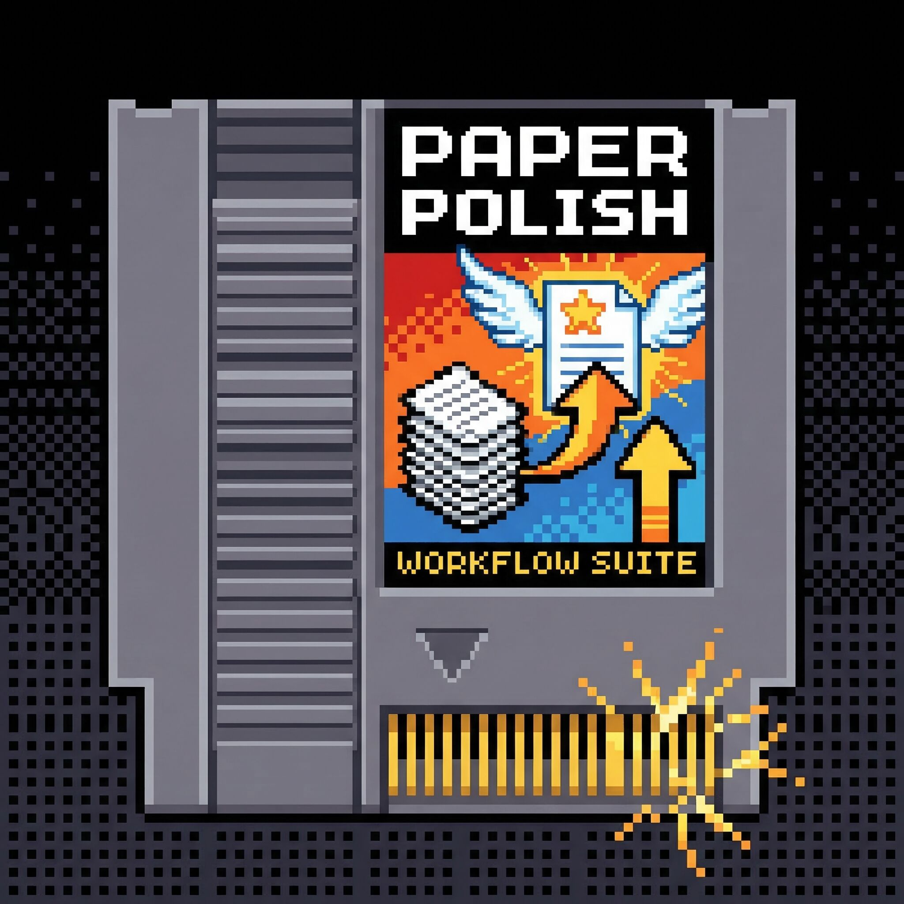

<p align="center">
  
</p>

<h1 align="center">Paper Polish Workflow</h1>

<p align="center">
  <strong>14 项学术论文写作、润色与投稿技能套件 —— 基于 Claude Code 驱动。</strong>
</p>

<p align="center">
  
  
  
</p>

---

[中文](#chinese) | [English](#english)

---

<a name="chinese"></a>

## 安装说明

### 方式一：通过 Claude Code 安装（推荐）

将以下 prompt 直接粘贴到 Claude Code 中执行：

> 请从 GitHub Packages 安装 `@lylll9436/paper-polish-workflow-skill` 到当前项目：
>
> 1. 在 `~/.npmrc` 中添加 `@lylll9436:registry=https://npm.pkg.github.com`（如果还没有的话）
> 2. 运行 `npm install @lylll9436/paper-polish-workflow-skill`
> 3. 将 `node_modules/@lylll9436/paper-polish-workflow-skill/.claude/skills/` 下所有子目录复制到当前项目的 `.claude/skills/`
> 4. 将 `node_modules/@lylll9436/paper-polish-workflow-skill/references/` 复制到当前项目的 `references/`
> 5. 安装完成后清理 node_modules

### 方式二：手动安装

```bash
# 1. 配置 npm 使用 GitHub Packages registry
echo "@lylll9436:registry=https://npm.pkg.github.com" >> ~/.npmrc

# 2. 安装包
npm install @lylll9436/paper-polish-workflow-skill

# 3. 将 skills 和 references 复制到你的项目中
cp -r node_modules/@lylll9436/paper-polish-workflow-skill/.claude/skills/* .claude/skills/
cp -r node_modules/@lylll9436/paper-polish-workflow-skill/references/ references/
```

### Semantic Scholar MCP 配置（适用于 ppw:literature）

`ppw:literature` 需要 Semantic Scholar MCP 服务器来检索学术文献。配置步骤如下：

1. 打开 Claude Code 设置。
2. 进入 **MCP Servers**（MCP 服务器）。
3. 添加 Semantic Scholar MCP 服务器（服务器键名：`semanticscholar`）。
4. 重启 Claude Code。

配置完成后，即可在 Claude Code 会话中直接触发文献检索。

---

## 技能清单

所有技能统一使用 `ppw:` 命名空间前缀，通过 `/ppw:技能名` 调用。

### 写作工作流

| 技能 | 触发示例 | 功能描述 |
|------|---------|---------|
| `/ppw:translation` | `翻译这段中文为英文` | 将中文学术草稿翻译为投稿级英文，生成 LaTeX 格式输出，包含中英文段落对照。 |
| `/ppw:polish` | `润色这段英文` | 通过快速修复或引导式多轮工作流润色英文学术文本，支持期刊风格适配与原地编辑追踪。 |
| `/ppw:de-ai` | `降AI这段论文` | 检测并改写英文学术文本中的 AI 生成痕迹，两阶段工作流：扫描标记风险，再批量改写。 |
| `/ppw:reviewer-simulation` | `审稿这篇论文` | 模拟同行评审，生成结构化双语审稿报告，包含评分与可操作的改进建议。 |

### 论文生成

| 技能 | 触发示例 | 功能描述 |
|------|---------|---------|
| `/ppw:repo-to-paper` | `从我的实验仓库生成论文` | 扫描 Python ML 实验仓库，逐级生成论文大纲（H1/H2/H3），每级用户确认后推进，最终生成带证据标注、引用和双语输出的正文文本。 |

### 辅助工具

| 技能 | 触发示例 | 功能描述 |
|------|---------|---------|
| `/ppw:abstract` | `帮我写摘要` | 使用五句话 Farquhar 公式生成或优化摘要，支持从零生成和改写现有摘要两条路径。 |
| `/ppw:cover-letter` | `帮我写投稿信` | 生成投稿信，包含贡献声明、数据可用性声明、利益冲突声明和联系方式。 |
| `/ppw:experiment` | `帮我分析实验结果` | 分析实验结果并生成有依据的讨论段落，两阶段：提取发现，再生成讨论。 |
| `/ppw:caption` | `帮我写图表标题` | 生成或优化学术论文的图表标题，地理感知：支持研究区域、坐标系标注和数据来源。 |
| `/ppw:logic` | `检查我的论文逻辑` | 验证论文各章节的逻辑一致性，追踪论证链，识别逻辑断裂、无支撑声明、术语不一致和数字矛盾。 |
| `/ppw:literature` | `帮我找关于城市热岛的文献` | 通过 Semantic Scholar MCP 检索学术文献并生成经过验证的 BibTeX 引用。需要 Semantic Scholar MCP。 |
| `/ppw:visualization` | `帮我选择合适的可视化方式` | 为实验数据推荐合适的图表类型，提供理由和工具提示，地理感知：空间数据时推荐分级地图、空间散点图等。 |

### 团队协作

| 技能 | 触发示例 | 功能描述 |
|------|---------|---------|
| `/ppw:team` | `ppw:team polish paper.tex` | 团队协作模式：将论文拆分为章节，通过子代理并行运行任意适用技能（polish、translation、de-ai）。支持 LaTeX `\section{}` 和 Markdown `# H1` 拆分，包含概念验证质量门控。 |

### 维护工具

| 技能 | 触发示例 | 功能描述 |
|------|---------|---------|
| `/ppw:update` | `更新技能` / `sync skills` | 从 GitHub 仓库下载最新的 skills 和 references 文件并更新本地版本。 |

---

## 快速上手

### 场景一：论文投稿流程

使用此工作链，将中文草稿一步步推进到可投稿的英文论文：

1. `/ppw:translation` — 将中文草稿翻译为学术英文，输出 LaTeX 格式。
2. `/ppw:polish` — 对英文文本进行期刊级润色，保留修改记录。
3. `/ppw:de-ai` — 扫描 AI 生成痕迹，对标记段落进行改写。
4. `/ppw:reviewer-simulation` — 在投稿前获取包含评分和可操作建议的结构化模拟审稿报告。

### 场景二：从实验仓库生成论文

1. `/ppw:repo-to-paper` — 扫描 Python ML 仓库，生成完整论文大纲和正文。
2. `/ppw:polish` — 润色生成的英文文本。
3. `/ppw:literature` — 检索补充文献并生成 BibTeX。

### 场景三：图表辅助

准备图表时，配合使用这两个技能：

1. `/ppw:caption` — 生成或改进图表标题，地图类图表支持地理元数据。
2. `/ppw:visualization` — 为实验数据推荐图表类型，附工具提示。

### 场景四：团队协作模式

对长论文进行章节级并行处理，适合全文润色、翻译或去 AI 痕迹：

1. `/ppw:team polish paper.tex` — 自动拆分论文为章节，选择目标章节，通过子代理对单个章节运行概念验证（PoC，Proof of Concept：先用一个子代理处理一个章节，确认输出质量与主会话一致后再扩展到全部章节）。
2. 确认子代理输出质量后，后续版本将支持全章节并行派发。

支持的子技能：`polish`、`translation`、`de-ai`。支持 `.tex` 和 `.md` 格式。

### 场景五：文献搜索流程

1. `/ppw:literature` — 通过 Semantic Scholar MCP 检索文献并生成经验证的 BibTeX 引用。
2. `/ppw:abstract` — 使用五句话 Farquhar 公式生成或改写摘要。

---

## 参与贡献

发现了 Bug 或有功能需求？请在 GitHub 上提交 Issue：

- **Bug 反馈** — 描述异常行为、触发的技能名称以及你的输入内容。
- **功能需求** — 描述你想要自动化的写作任务和期望的输出结果。

详细的贡献指南请参考 [CONTRIBUTING.md](CONTRIBUTING.md) 和 [CONTRIBUTING_CN.md](CONTRIBUTING_CN.md)。

---

## 致谢

本项目的核心写作技能改编自 [**awesome-ai-research-writing**](https://github.com/Leey21/awesome-ai-research-writing) 中的提示词模板——该仓库收录了来自顶级科研机构（MSRA、Seed、上海 AI 实验室）和高校（北大、中科大、上交大）的学术写作提示词。本项目将这些提示词重构为模块化的 Claude Code Skill，配备 YAML 前置配置、共享参考文件库和交互式多步工作流。

改编来源包括：翻译、润色、去 AI 痕迹、模拟审稿、摘要生成、图表标题、逻辑验证、实验分析和可视化建议等技能。投稿信、文献搜索和 repo-to-paper 技能为原创扩展。

`ppw:abstract` 中的 5 句摘要结构采用 **Farquhar formula**。

本项目的开发工作流由 [**get-shit-done**](https://github.com/gsd-build/get-shit-done) 提供支持——一套基于 Claude Code 的结构化 AI 协作开发框架。

---

<a name="english"></a>

## Installation

### Option 1: Install via Claude Code (Recommended)

Paste the following prompt directly into Claude Code:

> Install `@lylll9436/paper-polish-workflow-skill` from GitHub Packages into the current project:
>
> 1. Add `@lylll9436:registry=https://npm.pkg.github.com` to `~/.npmrc` if not already present
> 2. Run `npm install @lylll9436/paper-polish-workflow-skill`
> 3. Copy all subdirectories from `node_modules/@lylll9436/paper-polish-workflow-skill/.claude/skills/` to `.claude/skills/` in the current project
> 4. Copy `node_modules/@lylll9436/paper-polish-workflow-skill/references/` to `references/`
> 5. Clean up node_modules after installation

### Option 2: Manual Installation

```bash
# 1. Configure npm to use GitHub Packages registry
echo "@lylll9436:registry=https://npm.pkg.github.com" >> ~/.npmrc

# 2. Install the package
npm install @lylll9436/paper-polish-workflow-skill

# 3. Copy skills and references into your project
cp -r node_modules/@lylll9436/paper-polish-workflow-skill/.claude/skills/* .claude/skills/
cp -r node_modules/@lylll9436/paper-polish-workflow-skill/references/ references/
```

### Semantic Scholar MCP Setup (for ppw:literature)

`ppw:literature` requires the Semantic Scholar MCP server to search academic literature. To enable it:

1. Open Claude Code settings.
2. Navigate to **MCP Servers**.
3. Add the Semantic Scholar MCP server (server key: `semanticscholar`).
4. Restart Claude Code.

Once set up, you can trigger literature searches directly from your Claude Code session.

---

## Skill Inventory

All skills use the `ppw:` namespace prefix. Invoke with `/ppw:skill-name`.

### Writing Workflow

| Skill | Trigger Examples | Description |
|-------|-----------------|-------------|
| `/ppw:translation` | `Translate this Chinese draft to English` | Translate Chinese academic text into polished English for journal submission. Produces LaTeX output with bilingual paragraph-by-paragraph comparison. |
| `/ppw:polish` | `Polish this paragraph` | Polish English academic text through quick-fix or guided multi-pass workflow. Adapts to journal style with in-place editing and change tracking. |
| `/ppw:de-ai` | `De-AI this paragraph` | Detect and rewrite AI-generated patterns in English academic text. Two-phase workflow: scan with risk tagging, then batch rewrite. |
| `/ppw:reviewer-simulation` | `Review this paper` | Simulate peer review of academic papers with structured bilingual feedback report, scoring, and actionable suggestions. |

### Paper Generation

| Skill | Trigger Examples | Description |
|-------|-----------------|-------------|
| `/ppw:repo-to-paper` | `Generate a paper from my experiment repo` | Scan a Python ML experiment repo, generate a complete paper outline (H1/H2/H3) with user checkpoints at each level, then produce body text with evidence annotations, citations, and bilingual output. |

### Support Tools

| Skill | Trigger Examples | Description |
|-------|-----------------|-------------|
| `/ppw:abstract` | `Write an abstract for my paper` | Generate or optimize abstracts using the 5-sentence Farquhar formula. Supports generate-from-scratch and restructure-existing paths. |
| `/ppw:cover-letter` | `Write a cover letter for my CEUS submission` | Generate submission-ready cover letters with contribution statement, data availability, conflict of interest, and contact block. |
| `/ppw:experiment` | `Analyze my experiment results` | Analyze experiment results and generate grounded discussion paragraphs. Two-phase: extract findings, then write discussion. |
| `/ppw:caption` | `Write a caption for my figure` | Generate or optimize figure/table captions for academic papers. Geography-aware: study area, CRS notation, data source. |
| `/ppw:logic` | `Check the logic of my paper` | Verify logical consistency across paper sections. Traces argument chains and identifies gaps, unsupported claims, terminology inconsistencies, and number contradictions. |
| `/ppw:literature` | `Find papers about urban heat island` | Search academic literature via Semantic Scholar MCP and generate verified BibTeX entries. Requires Semantic Scholar MCP. |
| `/ppw:visualization` | `What chart should I use for this data?` | Recommend appropriate chart types for experimental data with rationale and tool hints. Geography-aware: choropleth, spatial scatter, kernel density when spatial data detected. |

### Team Orchestration

| Skill | Trigger Examples | Description |
|-------|-----------------|-------------|
| `/ppw:team` | `ppw:team polish paper.tex` | Team mode: split a paper into sections and run any eligible Skill (polish, translation, de-ai) across sections via subagents. Supports LaTeX `\section{}` and Markdown `# H1` splitting with proof-of-concept quality gate. |

### Maintenance

| Skill | Trigger Examples | Description |
|-------|-----------------|-------------|
| `/ppw:update` | `Update skills` / `Sync skills` | Download latest skills and references from the GitHub repo and update local files. |

---

## Quick Start

### Scenario 1: Paper Submission Chain

Use this chain to take a Chinese draft all the way to a reviewer-ready English manuscript:

1. `/ppw:translation` — Translate your Chinese draft into academic English with LaTeX output.
2. `/ppw:polish` — Polish the English text for journal submission style, with change tracking.
3. `/ppw:de-ai` — Scan for AI-generated patterns and rewrite flagged passages.
4. `/ppw:reviewer-simulation` — Get a structured peer review report with scores and actionable suggestions before submission.

### Scenario 2: Repo-to-Paper Pipeline

1. `/ppw:repo-to-paper` — Scan your Python ML repo, generate a full paper outline and body text.
2. `/ppw:polish` — Polish the generated English text.
3. `/ppw:literature` — Search for supplementary references and generate BibTeX.

### Scenario 3: Figure and Table Assistance

Use these Skills together when preparing figures and tables:

1. `/ppw:caption` — Generate or improve a figure or table caption, with geography-aware metadata for maps.
2. `/ppw:visualization` — Get chart type recommendations for your experimental data, with tool hints.

### Scenario 4: Team Mode

Process long papers section-by-section in parallel — ideal for full-paper polish, translation, or de-AI:

1. `/ppw:team polish paper.tex` — Auto-split the paper into sections, select targets, and run a PoC (Proof of Concept) validation — a single subagent processes one section first to verify output quality matches main-session execution before scaling to all sections.
2. After confirming subagent output quality, future versions will support full parallel dispatch across all sections.

Eligible sub-skills: `polish`, `translation`, `de-ai`. Supports `.tex` and `.md` formats.

### Scenario 5: Literature Search Chain

1. `/ppw:literature` — Search academic literature via Semantic Scholar MCP and generate verified BibTeX entries.
2. `/ppw:abstract` — Generate or restructure your abstract using the 5-sentence Farquhar formula.

---

## Contributing

Found a bug or have a feature request? Open an issue on GitHub:

- **Bug reports** — describe the unexpected behavior, which Skill triggered it, and your input.
- **Feature requests** — describe the writing task you want to automate and the expected output.

See [CONTRIBUTING.md](CONTRIBUTING.md) and [CONTRIBUTING_CN.md](CONTRIBUTING_CN.md) for detailed contribution guidelines.

---

## Acknowledgements

The core writing Skills in this project are adapted from the prompt templates in [**awesome-ai-research-writing**](https://github.com/Leey21/awesome-ai-research-writing) — a curated collection of academic writing prompts from top research labs (MSRA, Seed, Shanghai AI Lab) and universities (PKU, USTC, SJTU). This project restructures those prompts as modular Claude Code Skills with YAML frontmatter, shared reference libraries, and interactive multi-step workflows.

Specifically adapted: translation, polish, de-AI, reviewer simulation, abstract, caption, logic verification, experiment analysis, and visualization recommendation. Cover letter, literature search, and repo-to-paper Skills are original extensions.

The 5-sentence abstract structure in `ppw:abstract` is based on the **Farquhar formula**.

The development workflow is powered by [**get-shit-done**](https://github.com/gsd-build/get-shit-done) — a structured Claude Code workflow framework for shipping software with AI agents.
