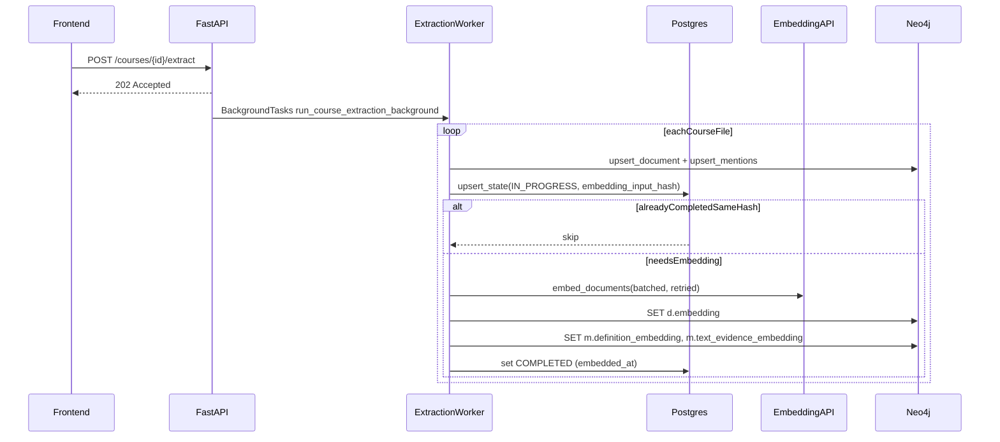

# Extraction->Embeddings pipeline

## Goal

After each document extraction succeeds and the extraction graph upserts complete, automatically (and safely/idempotently) generate embeddings and write them to Neo4j:

- `(:TEACHER_UPLOADED_DOCUMENT {id}).embedding`
- `(:TEACHER_UPLOADED_DOCUMENT)-[:MENTIONS]->(:CONCEPT).definition_embedding`
- `(:TEACHER_UPLOADED_DOCUMENT)-[:MENTIONS]->(:CONCEPT).text_evidence_embedding`

Maintain a SQL state table to skip redundant runs and allow safe re-embedding.

## Key design choices (confirmed)

- **Embedding credentials**: reuse existing `LAB_TUTOR_LLM_API_KEY` / `LAB_TUTOR_LLM_BASE_URL`; add embedding-specific model/dims.
- **Neo4j relationship vector index fallback**: store relationship vectors; attempt index creation; on failure skip with warning.
- **Neo4j vectors**: store vectors as properties and create vector indexes. Newer Neo4j supports native vectors and stronger constraints (see [Neo4j native vector type](https://neo4j.com/blog/developer/introducing-neo4j-native-vector-data-type/)); we’ll keep the backend storage format compatible with vector indexes and enforce dims at the application layer.

## Current extraction “completion hook”

Per-file extraction success happens here:

- [`backend/app/modules/document_extraction/service.py`](backend/app/modules/document_extraction/service.py): `_process_course_file_background()` right after `graph_repo.upsert_course_document()` + `graph_repo.upsert_mentions()`
- (Non-background path) `DocumentExtractionService.run_course_extraction()` right after the same upserts.

We’ll insert an EmbeddingOrchestrator call **immediately after those upserts**.

## Data flow

## Backend implementation plan

### 1) Add EmbeddingService (OpenAI-compatible)

- Add new module (feature-grouped): `backend/app/modules/embeddings/`
- `embedding_service.py`: `EmbeddingService.embed_documents(texts: list[str]) -> list[list[float]]`
- Use `langchain_openai.OpenAIEmbeddings` under the hood (already a runtime dependency).
- Add batching + retries:
    - Defaults: `batch_size=64`, `max_retries=3`, exponential backoff (e.g. 1s, 2s, 4s) + jitter.
- Validate output dims == configured dims (if provided) to fail fast.

### 2) Settings

- Extend [`backend/app/core/settings.py`](backend/app/core/settings.py) with:
- `embedding_model: str` (default e.g. `text-embedding-3-small`)
- `embedding_dims: int | None`
- Optional overrides: `embedding_api_key: str | None`, `embedding_base_url: str | None` (but default to `llm_api_key/base_url` if unset)
- `embedding_batch_size: int`, `embedding_max_retries: int`, `embedding_retry_base_seconds: float`

### 3) SQL state tracking (Postgres-backed)

- Add SQLAlchemy model + repository:
- `backend/app/modules/embeddings/models.py`: `DocumentEmbeddingState` mapped to `document_embeddings_state`
- `backend/app/modules/embeddings/repository.py`: get/upsert + status transitions
- Columns:
- `document_id` (PK)
- `course_id` (nullable)
- `content_hash` (nullable)
- `embedding_status` enum: `NOT_STARTED|IN_PROGRESS|COMPLETED|FAILED`
- `embedding_input_hash`
- `embedding_model`, `embedding_dim`
- `embedded_at` (nullable)
- `last_error` (nullable)
- “Migration mechanism”:
- This repo uses `Base.metadata.create_all()` on startup (see `backend/main.py`), so **adding the ORM model and importing it in `backend/main.py`** is the correct, minimal, cross-db migration approach.

### 4) EmbeddingOrchestrator

- Add `backend/app/modules/embeddings/orchestrator.py`:
- Input: `document_id`, `course_id`, `content_hash`, `document_text`, `mentions: list[MentionInput]`
- Compute deterministic `embedding_input_hash` from:
    - `doc_text`
    - each mention’s `definition`
    - each mention’s `text_evidence`
    - stable ordering (sort by `concept_name` and then field name)
- State machine:
    - if `COMPLETED` and hash+model+dim match → skip
    - else mark `IN_PROGRESS`, run, then mark `COMPLETED` (or `FAILED` with `last_error`)

### 5) Write embeddings back to Neo4j

- Extend [`backend/app/modules/document_extraction/neo4j_repository.py`](backend/app/modules/document_extraction/neo4j_repository.py):
- `set_document_embedding(document_id: str, vector: list[float])`
- `set_mentions_embeddings(document_id: str, concept_name: str, def_vec: list[float], ev_vec: list[float])`
- Cypher (concept names must be lowercased, matching current `toLower()` behavior):
- Document:
    - `MATCH (d:TEACHER_UPLOADED_DOCUMENT {id:$document_id}) SET d.embedding=$vector`
- Relationship:
    - `MATCH (d:TEACHER_UPLOADED_DOCUMENT {id:$document_id})-[m:MENTIONS]->(c:CONCEPT {name:$concept_name}) SET m.definition_embedding=$def_vec, m.text_evidence_embedding=$ev_vec`

### 6) Hook orchestrator after extraction success

- In [`backend/app/modules/document_extraction/service.py`](backend/app/modules/document_extraction/service.py):
- In `DocumentExtractionService.run_course_extraction()` and `_process_course_file_background()`:
    - right after Neo4j upserts, call `EmbeddingOrchestrator`.
- Background execution:
- The API already runs extraction in `BackgroundTasks` (`POST /courses/{id}/extract`). Embedding work will run within that same background pipeline (so it’s async from the request).

### 7) Neo4j constraints + vector indexes

- Update [`backend/app/core/neo4j.py`](backend/app/core/neo4j.py) in `initialize_neo4j_constraints`:
- Ensure uniqueness constraint on `TEACHER_UPLOADED_DOCUMENT.id` (already present; keep).
- Create vector index for `TEACHER_UPLOADED_DOCUMENT.embedding` (cosine, dims from settings).
- Attempt to create relationship vector indexes for `MENTIONS.definition_embedding` and `MENTIONS.text_evidence_embedding`.
    - If relationship vector indexes aren’t supported, catch `Neo4jError`, log a warning, continue.
- All schema statements must be idempotent (`IF NOT EXISTS`) and best-effort (never block startup).

## Tests (pytest)

Add/extend tests under `backend/tests/`:

- `backend/tests/modules/document_extraction/test_extraction_flow.py`
- embeddings orchestrator invoked after extraction success (mock embedding service + mock graph repo)
- New: `backend/tests/modules/embeddings/test_embedding_state.py`
- skip when `embedding_input_hash` unchanged and status COMPLETED
- rerun when inputs change
- FAILED state stores error
- New: `backend/tests/modules/embeddings/test_neo4j_writeback.py`
- verify cypher calls set `d.embedding`, `m.definition_embedding`, `m.text_evidence_embedding`
- New: `backend/tests/test_neo4j_schema_init.py`
- `initialize_neo4j_constraints` is safe when called twice; vector index creation failure is swallowed with warning

## Frontend (shadcn + TS/React) — suggested follow-up

Not required for acceptance, but to make it visible/manageable in UI:

- Add a small “Embeddings” section on the course detail page:
- status badge (NOT_STARTED/IN_PROGRESS/COMPLETED/FAILED)
- last embedded timestamp + last error
- “Re-embed” button
- This would require adding backend endpoints (future PR):
- `GET /courses/{course_id}/embeddings/status`
- `POST /courses/{course_id}/embeddings/reembed` or per-document.

## Files likely touched

- `backend/app/modules/document_extraction/service.py`
- `backend/app/modules/document_extraction/neo4j_repository.py`
- `backend/app/core/settings.py`
- `backend/app/core/neo4j.py`