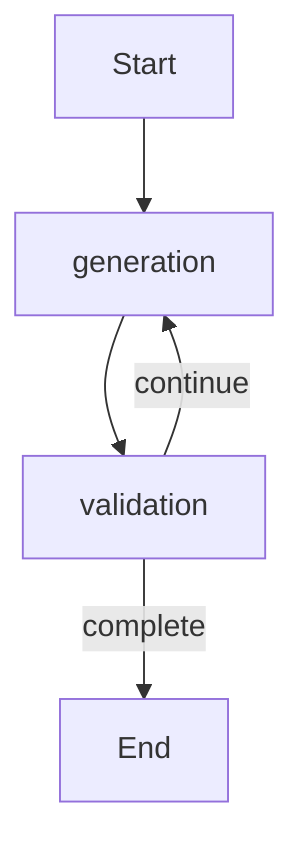

# Refactor concept_normalization to generator-evaluator loop

## Goal

Replace the current orchestrator/worker/aggregate/validate pipeline in the backend normalization workflow with a single-threaded **Generator → Evaluator** loop that:

- Calls the LLM once per iteration on the **full concept list**
- Accumulates **unique** valid merges programmatically
- Feeds back **rejected (weak) merges forever** to avoid repeats
- Converges when **new_unique_merges < 3 for 2 consecutive iterations** or when **max_iterations = 8**
- Keeps SSE event shape (`NormalizationStreamEvent`) unchanged so the frontend continues to work.

## Files to change

- [`/Users/khajievroma/Projects/lab_tutor/backend/app/modules/concept_normalization/service.py`](/Users/khajievroma/Projects/lab_tutor/backend/app/modules/concept_normalization/service.py)
- [`/Users/khajievroma/Projects/lab_tutor/backend/app/modules/concept_normalization/prompts.py`](/Users/khajievroma/Projects/lab_tutor/backend/app/modules/concept_normalization/prompts.py) (Option A: add avoid-list placeholders)
- (Optional/minor) [`/Users/khajievroma/Projects/lab_tutor/backend/app/modules/concept_normalization/models.py`](/Users/khajievroma/Projects/lab_tutor/backend/app/modules/concept_normalization/models.py) if we reuse/extend `ConceptNormalizationState` instead of `ConceptNormalizationOrchestratorState`

## Implementation outline

### 1) Replace the LangGraph structure

Update `_create_workflow()` in `ConceptNormalizationService` to a 2-node loop:

- `generation` node: calls LLM to propose merges (full list)
- `validation` node: validates merges vs definitions, updates `all_merges`/`weak_merges`, computes `new_unique_merges`
- Add a conditional edge from `validation` using a new `_convergence_checker()` that returns `"continue"` or `END`.

Implementation should mirror the pattern in `knowledge_graph_builder/services/enhanced_langgraph_service.py` (`_find_similar_concepts`): build a full `concept_list`, format accumulated weak items into a single “avoid list” string, then `ChatPromptTemplate.format_messages(...)` and `chain.invoke(messages)` with structured output.

### 2) Generator node (LLM)

- **Option A (selected)**: update `CONCEPT_NORMALIZATION_USER_TEMPLATE` in `backend/app/modules/concept_normalization/prompts.py` to include:\n+  - `# AVOID These Weak Merges ({num_weak})` and `{weak_merges_list}`\n+  - keep the rest of the instructions intact.\n+- Build `concept_list` from **all** concept names.\n+- Build `weak_merges_list` from accumulated `weak_merges` (rejected forever) using a helper like `_format_weak_merges(weak_merges: dict[str, str]) -> str`.\n+- Format messages via `CONCEPT_NORMALIZATION_PROMPT.format_messages(num_concepts=..., concept_list=..., num_weak=..., weak_merges_list=...)`.\n+- Invoke `self._merge_chain` (structured output `MergeBatch`) to produce `new_merge_batch`.

### 3) Evaluator node (LLM + programmatic accumulation)

- Convert `new_merge_batch` to a validation request using `MERGE_VALIDATION_PROMPT` with definitions from `ConceptNormalizationRepository.get_concept_definitions_for_course()`.
- Update `weak_merges` with any returned weak items.
- Filter valid merges as: `new_merge_batch` minus any whose key appears in `weak_merges`.
- Deduplicate/accumulate into `all_merges` using `make_merge_key()`.
- Track `new_unique_merges` (how many keys were newly added to `all_merges` this iteration) and append it to `convergence_metrics.new_unique_merges_trend`.
- Populate SSE-friendly deltas: `latest_merges` = the new unique accepted merges; `merges_found` = `len(latest_merges)`; `total_merges` = `len(all_merges)`.

### 4) Convergence logic

Implement `_convergence_checker(state)`:

- If `iteration_count >= max_iterations` → stop.
- Else if the last two `new_unique_merges` values are both `< 3` → stop.
- Else continue.

### 5) Preserve SSE contract (frontend unchanged)

In `normalize_concepts_stream()`:

- Continue streaming `NormalizationStreamEvent` with the same fields.
- Keep `phase` mapped from metadata (`generation` / `validation`) as today.
- Update `agent_activity` strings to reflect generator/evaluator steps.
- Keep `requires_review/review_id` behavior: on completion, create a review from accumulated merges (instead of clusters) so the UI can still show merge proposals.

## Mermaid (new flow)

