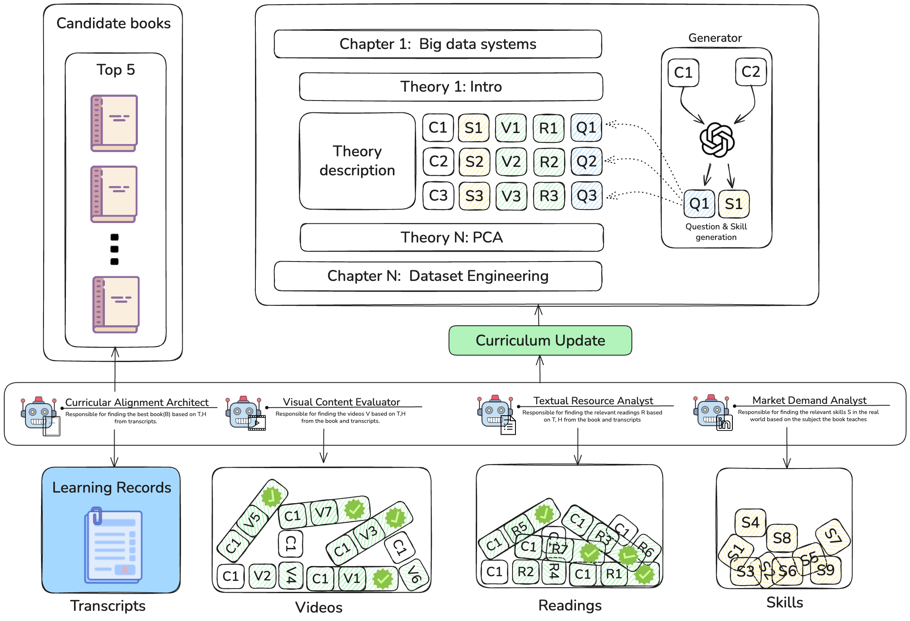

# Lab Tutor

An AI-powered platform that helps university teachers align their courses with industry demands using knowledge graphs, multi-agent workflows, and curriculum analysis.



## Tech Stack

| Layer | Technology |
|-------|-----------|
| **Frontend** | React 19, Vite, TailwindCSS v4, Shadcn UI, React Router v7 |
| **Backend** | FastAPI, SQLAlchemy 2.0, Pydantic v2, Python 3.12+ |
| **Databases** | PostgreSQL (+ pgvector), Neo4j (knowledge graph) |
| **AI/LLM** | LangChain, LangGraph, OpenAI-compatible API |
| **Storage** | Azure Blob Storage |
| **Observability** | LangSmith (optional) |

## Architecture

The backend follows **modular onion architecture** — each feature is a self-contained module under `backend/app/modules/`:

| Module | Status | Description |
|--------|--------|-------------|
| **Auth** | ✅ | JWT authentication, OAuth2, user management |
| **Courses** | ✅ | CRUD, file uploads, enrollment, Neo4j graph sync |
| **Concept Normalization** | ✅ | LLM-powered concept merging with human-in-the-loop review |
| **Embeddings** | ✅ | Vector embeddings (2048-dim) for courses & books |
| **Curricular Alignment Architect** | ✅ | Book discovery, PDF extraction, chapter-level curriculum alignment |
| **Market Demand Analyst** | ✅ | 3-agent LangGraph swarm for job market analysis |
| **Document Extraction** | ✅ | LLM-based PDF section extraction (internal service) |
| **Reading Agent** | 🔲 | Planned |
| **Video Agent** | 🔲 | Planned |

### Curricular Alignment Architect

Multi-phase LangGraph workflow for book discovery, scoring, downloading, and chapter-level curriculum alignment.

```
                          Teacher
                            │
               POST /book-selection/sessions/start
                            │
                ┌───────────▼────────────────┐
                │  BookSelectionService       │
                │  start_session()            │
                └───────────┬────────────────┘
                            │
        ┌───────────────────┼───────────────────┐
        │                   │                   │
┌───────▼───────┐  ┌───────▼───────┐  ┌───────▼───────┐
│ PHASE 1       │  │ PHASE 2       │  │ PHASE 3       │
│ DISCOVER      │  │ SCORE         │  │ DOWNLOAD      │
│               │  │               │  │               │
│ generate      │  │ fan_out       │  │ fan_out       │
│ search queries│  │ scoring       │  │ downloads     │
│ → web search  │  │ (parallel LLM │  │ (parallel per │
│ → merge &     │  │  per book)    │  │  book)        │
│   deduplicate │  │               │  │               │
│               │  │ Criteria:     │  │ → fetch PDF   │
│ HITL: teacher │  │ alignment,    │  │ → Azure Blob  │
│ selects books │  │ scope, author │  │ → or MANUAL   │
└───────┬───────┘  └───────┬───────┘  └───────┬───────┘
        │                  │                   │
        └──────────────────┼───────────────────┘
                           │
              ┌────────────▼──────────────┐
              │ PHASE 4: CHUNK & EMBED    │
              │                           │
              │ Extract text → chunks     │
              │ Embed via EmbeddingService│
              │ Store in Neo4j + SQL      │
              └────────────┬──────────────┘
                           │
           ┌───────────────┼───────────────┐
           │               │               │
    ┌──────▼──────┐ ┌──────▼──────┐ ┌─────▼───────┐
    │ PostgreSQL  │ │   Neo4j     │ │ Azure Blob  │
    │ Session +   │ │ BOOK,       │ │ PDF storage │
    │ CourseBook  │ │ CHAPTER,    │ │             │
    │ status      │ │ SECTION,    │ │             │
    │             │ │ CONCEPT     │ │             │
    └─────────────┘ └─────────────┘ └─────────────┘
```

> **HITL checkpoints**: After discovery (select books), after scoring (review), during download (monitor). State persisted via `AsyncPostgresSaver`.

See [docs/CURRICULAR_ALIGNMENT_ARCHITECT.md](docs/CURRICULAR_ALIGNMENT_ARCHITECT.md) for full architecture.

### Market Demand Analyst — 3-Agent Swarm

Uses a LangGraph swarm with three cooperating agents:

```
┌─────────────────────────────────────────────────────────────────────┐
│                        React Frontend                               │
│   (SSE Client — renders agent text, tool calls, state updates)      │
└───────────────────────────┬─────────────────────────────────────────┘
                            │ POST /market-demand/chat
                            │ SSE stream
┌───────────────────────────▼─────────────────────────────────────────┐
│                      FastAPI SSE Router                              │
│   routes.py — deterministic thread per user, event serialization    │
└───────────────────────────┬─────────────────────────────────────────┘
                            │
┌───────────────────────────▼─────────────────────────────────────────┐
│                    LangGraph Swarm Runtime                           │
│                                                                      │
│  ┌──────────────┐   start_analysis_pipeline()   ┌──────────────────┐│
│  │  Supervisor   │─ ─(programmatic extraction)─ ▶│Curriculum Mapper ││
│  │ (entry point) │◀──transfer_to_supervisor──────│                  ││
│  │               │                               └──────────────────┘│
│  │               │───transfer_to_concept_linker──▶┌────────────────┐│
│  │               │◀──transfer_to_supervisor───────│ Concept Linker ││
│  └──────────────┘                                └────────────────┘│
│                                                                      │
│  Shared: tool_store (module-level dict, persisted to PostgreSQL)     │
│  Checkpointing: AsyncPostgresSaver (psycopg connection pool)        │
└─────────────────────┬──────────────────┬────────────────────────────┘
                      │                  │
         ┌────────────▼──┐    ┌──────────▼───────┐
         │  Job Boards    │    │    Neo4j          │
         │  (Indeed,      │    │  Knowledge Graph  │
         │   LinkedIn)    │    │                   │
         └───────────────┘    └──────────────────┘
```

- **Supervisor** — Orchestrator: fetches jobs, triggers skill extraction, delegates to other agents
- **Curriculum Mapper** — Compares extracted skills against course chapters (Covered / Gap / New Topic)
- **Concept Linker** — Maps approved skills to Neo4j concepts and writes nodes + relationships

> Skill extraction is a programmatic batch process (parallel LLM calls) — not a separate agent.

See [docs/MARKET_DEMAND_ANALYST.md](docs/MARKET_DEMAND_ANALYST.md) for full architecture.

### Document Extraction & Concept Normalization

```
┌──────────────────────────────────────────────────────────────────┐
│  Teacher uploads files → POST /courses/{id}/upload-presentations │
└──────────────────────────┬───────────────────────────────────────┘
                           │
              ┌────────────▼────────────────┐
              │  Document Extraction Service │
              │                             │
              │  For each file:             │
              │  1. Download from Azure Blob│
              │  2. Parse (PDF/DOCX/TXT)    │
              │  3. LLM structured extract: │
              │     topic, summary,         │
              │     keywords, concepts[]    │
              │  4. Write to Neo4j:         │
              │     DOCUMENT → MENTIONS →   │
              │     CONCEPT                 │
              └────────────┬────────────────┘
                           │
              ┌────────────▼────────────────┐
              │  Embeddings Service          │
              │                             │
              │  Parallel workers:          │
              │  1. Embed document text     │
              │  2. Embed concept mentions  │
              │  3. Store vectors in Neo4j  │
              │     CHUNK nodes + MENTIONS  │
              └────────────┬────────────────┘
                           │
              ┌────────────▼─────────────────────────┐
              │  Concept Normalization (LangGraph)    │
              │                                      │
              │  ┌──────────┐    ┌───────────────┐   │
              │  │ Generate  │──▶│   Validate    │   │
              │  │ merge     │   │   merges      │   │
              │  │ proposals │◀──│   (LLM re-    │   │
              │  │ (LLM)    │   │    validates)  │   │
              │  └──────────┘   └───────┬───────┘   │
              │       iterates until     │           │
              │       convergence        │           │
              │                 ┌────────▼────────┐  │
              │                 │ HITL Review     │  │
              │                 │ Teacher:        │  │
              │                 │ APPROVE/REJECT  │  │
              │                 └────────┬────────┘  │
              │                          │           │
              │                 ┌────────▼────────┐  │
              │                 │ Apply merges    │  │
              │                 │ APOC.refactor   │  │
              │                 │ .mergeNodes()   │  │
              │                 └─────────────────┘  │
              └──────────────────────────────────────┘
```

See [docs/CONCEPT_NORMALIZATION.md](docs/CONCEPT_NORMALIZATION.md) and [docs/DOCUMENT_EXTRACTION_AND_EMBEDDINGS.md](docs/DOCUMENT_EXTRACTION_AND_EMBEDDINGS.md) for full architecture.

## Quick Start

### Prerequisites

- **Docker & Docker Compose**
- **Node.js 18+** and **npm**
- **Python 3.12+** and [**uv**](https://docs.astral.sh/uv/)
- **PostgreSQL** (cloud or local)
- **Neo4j** instance (cloud or local Docker)

### 1. Clone & Configure

```bash
git clone https://github.com/khajiev13/lab_tutor.git
cd lab_tutor
cp .env.example .env   # Then fill in values (see Environment Variables below)
```

### 2. Backend

```bash
cd backend
uv sync                          # Install dependencies
uv run fastapi dev main.py       # Dev server → http://localhost:8000
```

### 3. Frontend

```bash
cd frontend
npm install
npm run dev                      # Dev server → http://localhost:5173
```

### 4. Docker (Alternative)

```bash
docker-compose up -d             # Starts backend + frontend
```

### 5. Knowledge Graph Data (Optional)

```bash
cd knowledge_graph_builder
uv sync
python scripts/ingest_ready_data.py          # Load pre-extracted data into Neo4j
python scripts/ingest_ready_data.py --clear  # Clear & reload
```

## Environment Variables

Create a `.env` file in the project root. All backend variables use the `LAB_TUTOR_` prefix.

### Required

| Variable | Description |
|----------|-------------|
| `LAB_TUTOR_DATABASE_URL` | PostgreSQL connection string |
| `LAB_TUTOR_SECRET_KEY` | JWT signing secret (**change in production**) |
| `LAB_TUTOR_LLM_API_KEY` | API key for LLM provider (OpenAI-compatible) |

### LLM & Embeddings

| Variable | Default | Description |
|----------|---------|-------------|
| `LAB_TUTOR_LLM_BASE_URL` | `https://api.silra.cn/v1/` | OpenAI-compatible endpoint |
| `LAB_TUTOR_LLM_MODEL` | `deepseek-v3.2` | Model identifier |
| `LAB_TUTOR_EMBEDDING_MODEL` | `text-embedding-v4` | Embedding model |
| `LAB_TUTOR_EMBEDDING_DIMS` | `2048` | Vector dimensions |
| `LAB_TUTOR_EMBEDDING_API_KEY` | ← LLM key | Separate embedding key |
| `LAB_TUTOR_EMBEDDING_BASE_URL` | ← LLM URL | Separate embedding endpoint |

### Neo4j

| Variable | Default | Description |
|----------|---------|-------------|
| `LAB_TUTOR_NEO4J_URI` | — | Bolt URI (`bolt://localhost:7687`) |
| `LAB_TUTOR_NEO4J_USERNAME` | — | Neo4j username |
| `LAB_TUTOR_NEO4J_PASSWORD` | — | Neo4j password |
| `LAB_TUTOR_NEO4J_DATABASE` | `neo4j` | Database name |

### Azure Blob Storage

| Variable | Default | Description |
|----------|---------|-------------|
| `LAB_TUTOR_AZURE_STORAGE_CONNECTION_STRING` | — | Azure connection string |
| `LAB_TUTOR_AZURE_CONTAINER_NAME` | `class-presentations` | Container name |

### Observability & Search

| Variable | Default | Description |
|----------|---------|-------------|
| `LAB_TUTOR_LANGSMITH_API_KEY` | — | Enables LangSmith tracing |
| `LAB_TUTOR_LANGSMITH_PROJECT` | `lab-tutor-backend` | LangSmith project |
| `LAB_TUTOR_SERPER_API_KEY` | — | Google Search (book discovery) |

### Frontend

| Variable | Description |
|----------|-------------|
| `VITE_API_URL` | Backend URL (default: `http://localhost:8000`) |

## API Endpoints

| Prefix | Module | Key Endpoints |
|--------|--------|--------------|
| `/auth` | Auth | `POST /jwt/login`, `POST /jwt/refresh`, `POST /register` |
| `/courses` | Courses | `GET /`, `POST /`, `GET /{id}/graph`, `POST /{id}/upload-presentations` |
| `/normalization` | Concepts | `GET /stream`, `POST /reviews/{id}/decisions` |
| `/book-selection` | Architect | `POST /sessions/start`, `POST /{book_id}/select`, `POST /courses/{id}/analysis` |
| `/market-demand` | MDA | `POST /chat` (SSE), `GET /state`, `GET /history` |
| `/health` | Health | Full dependency check |
| `/healthz` | Liveness | Lightweight probe |

Full API docs at `http://localhost:8000/redoc`

## Testing

```bash
# Backend (requires local PostgreSQL)
cd backend
LAB_TUTOR_DATABASE_URL="postgresql://user@localhost:5432/lab_tutor_test" uv run pytest -v

# Frontend lint
cd frontend
npm run lint
```

## Project Structure

```
lab_tutor/
├── backend/
│   ├── app/
│   │   ├── core/               # Settings, database, shared utilities
│   │   ├── modules/            # Feature modules (auth, courses, MDA, etc.)
│   │   └── providers/          # Infrastructure (Azure storage)
│   └── tests/
├── frontend/
│   └── src/
│       ├── components/         # Shadcn UI + custom components
│       ├── features/           # Feature pages (auth, courses, agents, etc.)
│       ├── hooks/              # Custom React hooks
│       └── services/           # API client (Axios)
├── knowledge_graph_builder/    # Neo4j data ingestion & concept extraction
├── neo4j_database/             # Neo4j Docker config & migrations
├── docs/                       # Architecture diagrams & images
└── docker-compose.yml
```

## Documentation

| Document | Description |
|----------|-------------|
| [MARKET_DEMAND_ANALYST.md](docs/MARKET_DEMAND_ANALYST.md) | 3-agent LangGraph swarm, SSE protocol, tool inventory, Neo4j schema |
| [CURRICULAR_ALIGNMENT_ARCHITECT.md](docs/CURRICULAR_ALIGNMENT_ARCHITECT.md) | Book discovery, scoring, download workflows, HITL interrupts |
| [CONCEPT_NORMALIZATION.md](docs/CONCEPT_NORMALIZATION.md) | Iterative merge workflow, APOC operations, review pipeline |
| [DOCUMENT_EXTRACTION_AND_EMBEDDINGS.md](docs/DOCUMENT_EXTRACTION_AND_EMBEDDINGS.md) | PDF parsing, LLM extraction, vector embedding pipeline |
| [POSTGRES_SCHEMA.md](docs/POSTGRES_SCHEMA.md) | Full PostgreSQL schema documentation |

## Contributing

1. Branch from `main`: `feat/<name>`, `fix/<name>`, `refactor/<area>`, or `chore/<topic>`
2. Write descriptive commits — not `"update"` or `"fix"`
3. Run tests before pushing
4. PR descriptions must include scope, behavior changes, and how to verify

### Clear and reload data
```bash
cd knowledge_graph_builder
python scripts/ingest_ready_data.py --clear
```

## Development

This project uses:
- **Neo4j**: Graph database
- **LangChain**: LLM orchestration (for future extraction tasks)
- **Python 3.12+**: Core language
- **uv**: Fast Python package manager

## Adding New Services

When adding new services, add them to the `docker-compose.yml` file and ensure they use the `lab_tutor_network` network to communicate with Neo4j.
