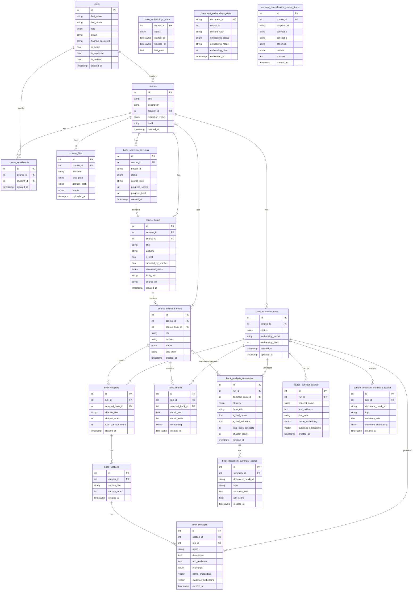

# PostgreSQL Schema

## Entity-Relationship Diagram



---

## Data Flow

1. A `users` (teacher) creates `courses`.
2. Students join via `course_enrollments`.
3. Teacher uploads `course_files` (presentations/docs → processed into Neo4j).
4. AI runs a `book_selection_session` → discovers candidate `course_books` → teacher picks → `course_selected_books`.
5. A `book_extraction_run` processes a selected book:
   - Splits into `book_chunks` (for vector search)
   - Extracts `book_chapters` → `book_sections` → `book_concepts`
   - Builds `course_concept_caches` and `course_document_summary_caches`
6. `book_analysis_summaries` scores each book against course Neo4j documents → `book_document_summary_scores` per document.

---

## Sample Entities (from production DB)

### `users`
```json
{
  "id": 1,
  "first_name": "Roma",
  "last_name": "Khajiev",
  "role": "TEACHER",
  "email": "raxmon1710@gmail.com",
  "is_active": true
}
```

### `courses`
```json
{
  "id": 1,
  "title": "Big Data",
  "teacher_id": 1,
  "level": "bachelor",
  "extraction_status": "finished"
}
```

### `course_files`
```json
{
  "id": 1,
  "course_id": 1,
  "filename": "4 types of NoSQL.docx",
  "status": "processed"
}
```

### `book_selection_sessions`
```json
{
  "id": 1,
  "course_id": 1,
  "thread_id": "bs-1-ece08d3bd682",
  "status": "completed",
  "course_level": "bachelor"
}
```

### `course_books`
```json
{
  "id": 1,
  "session_id": 1,
  "course_id": 1,
  "title": "Data Science from Scratch",
  "download_status": "pending"
}
```

### `course_selected_books`
```json
{
  "id": 10,
  "course_id": 1,
  "source_book_id": 26,
  "title": "Big Data: Concepts, Technology, and Architecture",
  "status": "downloaded"
}
```

### `book_extraction_runs`
```json
{
  "id": 3,
  "course_id": 1,
  "status": "embedding",
  "embedding_model": "text-embedding-v4",
  "embedding_dims": 2048
}
```

---

## Enum Types

| Enum | Values |
|------|--------|
| `user_role` | `TEACHER`, `STUDENT` |
| `extraction_status` | `pending`, `running`, `finished`, `failed` |
| `file_processing_status` | `pending`, `processing`, `processed`, `failed` |
| `book_session_status` | `pending`, `running`, `completed`, `failed` |
| `book_download_status` | `pending`, `downloading`, `downloaded`, `failed` |
| `book_status` | `pending`, `downloading`, `downloaded`, `failed` |
| `extraction_run_status` | `pending`, `running`, `embedding`, `finished`, `failed` |
| `analysis_strategy` | varies |
| `concept_relevance` | varies |
| `normalization_merge_decision` | varies |
| `embedding_status` | `pending`, `running`, `done`, `failed` |
| `course_embedding_status` | varies |
