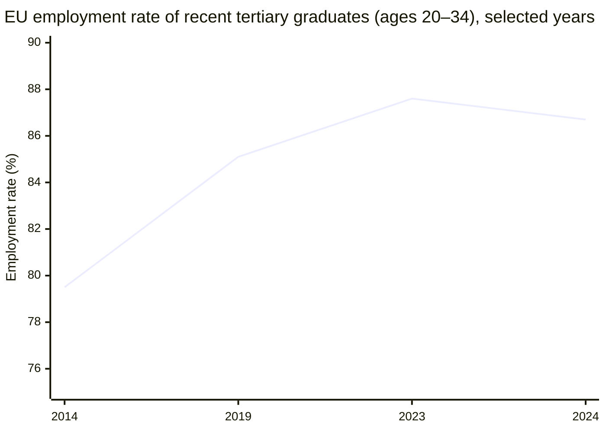
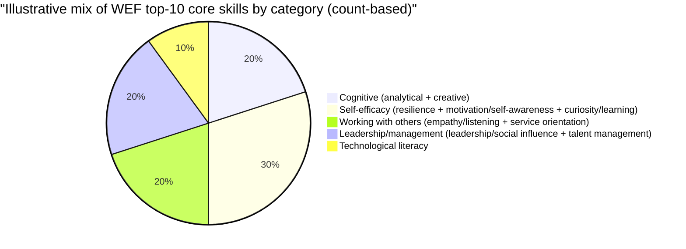
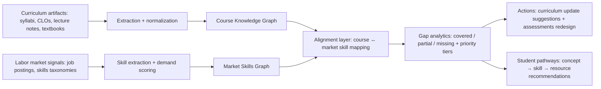

# Analytical Background on the Curriculum–Labor Market Gap and the Case for a Data-Driven Alignment System

## Executive summary

Across regions, higher education has expanded rapidly, yet the transition from education to stable, degree-relevant work is increasingly shaped by fast-changing skill requirements and persistent mismatch. In the EU, the 2024 employment rate for *recent tertiary graduates* (ages 20–34, not in education/training) was **86.7%**, but this follows a decade-long trajectory that still includes pandemic-era volatility and notable cross-country dispersion. citeturn6view0turn23view0 In the U.S., the labor market for *recent college graduates* weakened at the end of 2025: unemployment rose to **~5.7%** and underemployment to **42.5%** (the highest since 2020) in 2025:Q4. citeturn8view2 In parallel, large-scale evidence indicates that many graduates do not secure “college-level” jobs early in their careers: a joint Burning Glass Institute–Strada report finds **52%** of graduates are underemployed one year after graduation and **45%** remain underemployed even after a decade. citeturn22view0turn23view3

The core structural challenge is that *skills change faster than curricula*. Employers expect substantial disruption in workforce skills (e.g., **39%** of workers’ core skills changing by 2030 in the World Economic Forum’s 2025 survey results), and labor market analytics show large within-job skill turnover in short windows (e.g., the “average job” seeing **about one-third** of required skills change from 2021 to 2024, with **75%** turnover for the top quartile of occupations). citeturn12view0turn15view0turn23view2 This pace collides with university course frameworks that are often (i) document-centric and fragmented, (ii) updated in slower governance cycles, and (iii) not continuously mapped to job-posting skill signals—creating measurable gaps in coverage, recency, and demonstrable competency. citeturn0file0

This background section argues that a system is justified when it can: (a) ingest continuously updated labor market signals, (b) represent curriculum and resources in a structured skills/knowledge model, (c) compute, visualize, and explain coverage gaps, and (d) recommend targeted learning resources and curriculum updates with quality controls. The proposed system framing in “paper framework-Roma.docx” describes precisely this kind of pipeline (knowledge graph foundation → alignment layer → application layer) and adds a governance mechanism through human-in-the-loop checkpoints to mitigate hallucinations and ensure trust. fileciteturn0file0

## Problem definition and scope

The problem is a persistent **misalignment between what university programs teach and what employers require**—not only at the level of disciplinary knowledge, but at the level of **observable, job-relevant skills** (technical/digital tools, cognitive skills, socio-emotional “durable” skills, and domain-specific competencies). The mismatch manifests in three measurable ways:

First, **transition friction**: graduates take longer to obtain stable, degree-relevant employment, or accept jobs below their education level (overqualification/underemployment). The EU explicitly frames “employment rates of recent graduates” as an indicator of the education-to-work transition, defining “recent graduates” and tracking employment outcomes over time via the EU Labour Force Survey. citeturn6view0turn6view1turn23view0 In the U.S., the Federal Reserve Bank of New York tracks unemployment and underemployment for recent college graduates quarterly, highlighting sensitivity to labor market shifts. citeturn8view2

Second, **skills mismatch**: workers’ skills/qualifications do not match job requirements, creating productivity losses and wage penalties while coexisting with employer-reported talent shortages. OECD work on skills imbalance measurement and related evidence links shortages and mismatches to lower productivity and higher turnover/hiring costs, emphasizing the policy value of comparable indicators. citeturn4search19turn4search33

Third, **curriculum lag under rapid skill change**: employers’ skill needs evolve quickly due to digitalization, AI adoption, and the green transition. For example, LinkedIn’s analysis of global skill profiles reports that skills have changed **24% on average globally since 2015**. citeturn2search0 Lightcast’s job-posting-based research similarly finds about **32%** skill change for the average job from 2021 to 2024 (and much higher turnover for the most disrupted occupations). citeturn15view0turn23view2 The World Economic Forum’s 2025 survey results indicate employers expect high ongoing disruption and identify AI/data, cybersecurity, and technological literacy among the fastest-growing skill areas. citeturn12view0

**Scope**: This section treats the problem as **global in drivers and mechanisms** (technology diffusion, AI, green transition, remote/hybrid work, demographic shifts), but acknowledges that *local/regional calibration is unspecified* and should be supplied later through national labor statistics and locally representative job-posting data. The system justification therefore focuses on globally validated indicators and methods, while explicitly leaving placeholders for local baselines and target sectors.

## Statistical evidence on graduate outcomes, underemployment, and mismatch

A rigorous justification requires separating **employment**, **underemployment**, and **mismatch**, because they capture different failure modes. “Graduate employment” can look strong in aggregate while underemployment and mismatch remain high, especially for early career cohorts and certain fields.

In the EU, Eurostat reports that in 2024 the **average employment rate for recent graduates (20–34)** was **82.3%**; within that, recent tertiary graduates have the highest rates, and Eurostat documents a decade trend where recent tertiary graduates rose from **79.5% in 2014** to **87.6% in 2023**, before dipping to **86.7% in 2024**. citeturn6view0turn6view1turn23view0 These results demonstrate both improvement and sensitivity to macro shocks (e.g., COVID-19), reinforcing that “employment rate” alone does not imply tight alignment between programs and job requirements. citeturn6view0

Across OECD countries, employment outcomes for tertiary-educated adults remain comparatively strong, but the OECD highlights important variation by age and degree level. In 2024, the employment rate among **25–34 year-olds with tertiary education** averaged **87%**, and OECD-reported unemployment for younger tertiary graduates (25–34) averaged **5.1%**—not negligible when scaled across millions of entrants. citeturn8view0turn8view1

In the U.S., the New York Fed’s recent-graduate tracker shows that by 2025:Q4, **unemployment was ~5.7%** and **underemployment was 42.5%** for recent college graduates, signaling that early-career outcomes can diverge sharply from overall tertiary employment averages. citeturn8view2 Complementing this, a joint Burning Glass Institute–Strada report defines “underemployment” for four-year graduates as employment in jobs that don’t typically require a bachelor’s degree, and reports that **52%** of graduates are underemployed one year after graduation and **45%** remain underemployed after a decade. citeturn22view0turn23view3 The same report characterizes underemployment as “sticky” (with **73%** of those starting underemployed still underemployed ten years later) and highlights material earnings differences between college-level employment and underemployment. citeturn22view0turn23view3

At the global level, youth-labor-market exclusion remains substantial even when unemployment is historically low. The ILO reports the global youth unemployment rate was **13% in 2023** (a 15-year low), yet **20.4%** of the world’s youth were NEET in 2023—capturing broader exclusion than unemployment alone. citeturn9view0turn23view1 This matters for higher education because it underscores that smoother pathways are not guaranteed by enrollment expansion; transitions require aligned skills, employer absorption capacity, and effective matching mechanisms. citeturn9view0

Employer-side scarcity adds a second layer: ManpowerGroup’s 2024 global survey reports **~74–75% of employers** have difficulty filling roles, with high reported scarcity across multiple industries (including health care/life sciences and IT). citeturn5search1turn5search3 When high graduate underemployment coexists with high employer difficulty filling roles, the implication is not merely “too many graduates” but **structural mismatch and information/translation failure** between education outputs and job requirements. citeturn22view0turn5search1

### Comparative table of key indicators

| Geography (illustrative) | Graduate / youth outcome indicator | Underemployment / mismatch indicator | Skill-change / demand pressure indicator | Primary evidence |
|---|---|---|---|---|
| EU (EU aggregate) | Recent graduates (20–34) employment **82.3%** (2024); recent tertiary graduates **86.7%** (2024); recent tertiary graduates **79.5%** (2014) → **87.6%** (2023) → **86.7%** (2024) | Cross-country dispersion (e.g., total recent graduates **69.6%** Italy vs **91.6%** Netherlands in 2024) | — | Eurostat “Employment rates of recent graduates” citeturn6view0turn23view0 |
| OECD average | Young adults (25–34) with tertiary education employment **87%** (2024); bachelor’s **84%**, master’s **89%** (OECD averages) | Younger tertiary unemployment **5.1%** (25–34, OECD avg, 2024) | — | OECD Education GPS / EAG highlights citeturn8view0turn8view1 |
| United States | Recent college graduate unemployment **~5.7%** (2025:Q4) | Recent college graduate underemployment **42.5%** (2025:Q4) | — | Federal Reserve Bank of New York tracker citeturn8view2 |
| United States | — | Four-year graduates underemployed **52%** (1 year after graduation) and **45%** (10 years after) | — | Burning Glass Institute + Strada, *Talent Disrupted* (2024) citeturn22view0turn23view3 |
| Global | Youth unemployment **13%** (2023) | Youth NEET **20.4%** (2023) | — | ILO, *Global Employment Trends for Youth 2024* (Exec. Summary) citeturn9view0turn23view1 |
| Global / multi-industry employer surveys | — | — | Employers expect **39%** of core skills to change by 2030; AI/data and cybersecurity among fastest-growing skill areas | WEF, *Future of Jobs Report 2025* citeturn12view0 |
| U.S. labor-market analytics | — | — | Average job skill requirements changed by about **one-third** (2021→2024); top quartile saw **75%** skill turnover | Lightcast, *The Speed of Skill Change* citeturn15view0turn23view2 |
| Global employer survey | — | Employers struggling to fill roles **~74–75%** (2024) | Persistent talent scarcity across many sectors | ManpowerGroup Talent Shortage (2024) citeturn5search1turn5search3 |

## Research and literature on curriculum–employer misalignment

The curriculum–labor market gap is extensively documented in both policy research and academic literature, and the consistent conclusion is that misalignment is *multi-causal* and *systemic*.

One strand emphasizes **structural and governance lag**: curricula often require committee review, accreditation compliance, and multi-year revisions; employer needs, by contrast, shift continuously with technology and business model evolution. The “paper framework-Roma.docx” problem statement explicitly describes this lag as a “disconnect between curriculum and industry demands,” noting that curricula evolve slowly and that traditional evaluation relies on expert experience or lagging surveys rather than real-time data-driven alignment. fileciteturn0file0

A second strand focuses on **competency gaps**, particularly in multidisciplinary and transferable areas. U.S. employer survey evidence (AAC&U/Morning Consult, 2023) reports high overall confidence that higher education can prepare graduates, while simultaneously showing only about half of employers view graduates as “very prepared” in key skill areas such as oral communication and related workforce competencies—indicating that institutions may be producing credentials without consistently producing demonstrated proficiency. citeturn5search4turn5search6 Similarly, NACE reports sizable employer–student perception gaps in career-readiness competencies; for example, perceived proficiency gaps for leadership/professionalism exceed or approach **30%**, and gaps for critical thinking and communication are around **25%**. citeturn1search25

A third strand emphasizes **digital competency and tool fluency** as a cross-cutting bottleneck. In the U.S., the National Skills Coalition’s analysis (also cited in an FCC digital upskilling report) concludes that **92% of jobs require digital skills**, while nearly one-third of workers lack foundational digital skills—suggesting a broad digital-skills mismatch that universities must address not only in computing majors but economy-wide. citeturn11search35turn11search19

Finally, recent scholarship increasingly frames misalignment as **data and measurement failure**: without a common skills language and continuous mapping between curriculum artifacts and job requirements, “alignment” remains aspirational. LinkedIn’s skills taxonomy and longitudinal “future of skills” analysis, along with OECD/ILO skills mismatch measurement initiatives, illustrate how modern labor market intelligence can operationalize this mapping at scale. citeturn2search0turn1search0turn1search15

## Industry evidence on in-demand skills and hiring trends

The gap is widening not because universities teach “nothing useful,” but because **demand is evolving toward hybrid profiles** combining domain knowledge, technology-enabled workflows, and durable human skills.

The World Economic Forum’s 2025 survey results show employers expect ongoing high disruption: **39% of workers’ core skills** are expected to change by 2030. citeturn12view0 The same source identifies the top core skills today as a blend of cognitive and human skills (e.g., analytical thinking, resilience/flexibility/agility, leadership/social influence) while forecasting that **technological skills will grow in importance faster than any other type**, with **AI and big data** and **networks/cybersecurity** at the top of the “skills on the rise.” citeturn12view0 This is the signature of a labor market where entry-level roles increasingly expect graduates to be both analytically strong and digitally fluent.

Independent labor market analytics quantifies the velocity of change. Lightcast reports that from 2021 to 2024 the **average job** saw about **one-third** of its skill requirements change, and one in four jobs saw **75%** skill turnover in three years. citeturn15view0turn23view2 This is especially acute in many STEM and digitally intensive roles; the implication for higher education is straightforward: a multi-year curriculum revision cadence can drift materially out of sync within a single student cohort’s degree duration. citeturn15view0turn23view2

Platform-level evidence supports the same conclusion at global scale: LinkedIn’s analysis of member skill profiles finds **skills changed by 24% on average globally since 2015**, and the pace accelerated during the COVID-19 period. citeturn2search0turn3search9

Employer demand also increasingly emphasizes “durable” skills that are difficult to automate and broadly applicable. Burning Glass Institute analysis of **6.8 million** U.S. job postings (2022–2024) finds **41%** explicitly reference decision-making skills, with prevalence reaching **68%** in computer and mathematical occupations—evidence that even technical roles are framed around higher-order judgment. citeturn19search1turn19search4

Taken together, these sources support a central thesis: **skill demand is both rapidly shifting and increasingly hybrid**, requiring continuous translation mechanisms between curricula and job requirements rather than periodic, manual alignment exercises.

## Gap analysis between typical course frameworks and labor market requirements

Because the “local” context and specific university framework(s) are not provided, this section characterizes the gap in a way that is **measurable and portable**, while making explicit where local data should be inserted later.

A “typical” university course framework is often expressed through syllabi, learning outcomes, lecture materials, and textbooks. The uploaded framework document emphasizes that course content frequently exists in fragmented, unstructured artifacts (notes, slides, textbooks) without unified semantic modeling—limiting searchability, reuse, and alignment. fileciteturn0file0 In contrast, the labor market expresses demand through job postings, competency models, and rapidly evolving tool/skill taxonomies. A measurable gap emerges where:

**Coverage gap**: skills emphasized by employers are not explicitly present (or are only implicitly present) in learning outcomes and assessed tasks. Employer survey evidence indicates gaps in preparedness for oral communication, critical thinking/problem solving, and related competencies, suggesting incomplete coverage or weak assessment of these skills at graduation. citeturn5search4turn5search6turn1search25

**Recency gap**: the tools and workflows expected of graduates shift during the student’s time-to-degree. Lightcast quantifies that the “average job” changes about one-third of its skill requirements in three years (2021–2024), while WEF reports that employers expect 39% of core skills to change by 2030—both consistent with curriculum obsolescence risk. citeturn15view0turn23view2turn12view0

**Granularity gap**: employers recruit on specific skill bundles (e.g., “AI and big data,” “networks and cybersecurity,” “technological literacy”) whereas course catalogs often describe broader topics without fine-grained, machine-readable skill tagging. citeturn12view0turn2search0

**Evidence gap**: employers increasingly need proof of competency and applied ability; underemployment data implies that many graduates do not gain access to “college-level” job ladders early, and that the first job is pivotal. citeturn22view0turn23view3

### Table of in-demand skills versus typical curriculum treatment

The table below synthesizes cross-industry in-demand skills and contrasts them with commonly observed curriculum dynamics (explicit instruction, assessment, and currency), using employer surveys and global skill forecasts as evidence.

| Skill area (labor market signal) | Evidence of demand | Typical course framework treatment (general, not local-specific) | Measurable gap indicator |
|---|---|---|---|
| Analytical thinking | Top core skill; ~7 in 10 firms consider it essential (WEF) citeturn12view0 | Commonly targeted in theory-driven assignments, but proficiency may vary and is not always mapped to job tasks | Employer–student proficiency-perception gaps for critical thinking/related competencies ~25% (NACE) citeturn1search25 |
| Resilience, flexibility, agility | Top core skill cluster; rising importance (WEF) citeturn12view0 | Often treated implicitly; rarely assessed explicitly | Persistent underemployment over time indicates transition fragility (BGI/Strada) citeturn22view0turn23view3 |
| Leadership and social influence | Increased relevance vs 2023; top core skill set (WEF) citeturn12view0 | Often peripheral unless programs include project-based leadership development | Leadership/professionalism perception gaps approach/exceed ~30% (NACE) citeturn1search25 |
| AI and big data | Fastest-growing skills category (WEF) citeturn12view0 | Concentrated in CS/data programs; not consistently integrated across disciplines | High within-job skill turnover in disrupted occupations (Lightcast) citeturn15view0turn23view2 |
| Networks and cybersecurity | Among fastest-growing skills (WEF) citeturn12view0 | Often elective/specialization; may lag current threat/tool landscape | Employer difficulty filling roles remains high globally (ManpowerGroup) citeturn5search1turn5search3 |
| Technological literacy / digital fluency | Included among top/fast-growing skill areas (WEF) citeturn12view0 | Frequently assumed rather than systematically taught across majors | 92% of jobs require digital skills (NSC; cited in FCC report) citeturn11search35turn11search19 |
| Communication (oral/written) | Employers value it highly; many report graduates not “very prepared” (AAC&U reporting) citeturn5search6turn5search4 | Present in general education and presentations, but inconsistent assessment of workplace-standard writing/speaking | Only about half of employers report graduates are “very prepared” in oral communication (AAC&U coverage) citeturn5search6turn5search4 |
| Decision-making / judgment under uncertainty | 41% of postings reference decision skills; 68% in computer/math roles (BGI) citeturn19search1turn19search4 | Often embedded in capstones; seldom decomposed into measurable micro-skills | Posting prevalence provides a quantitative target for explicit skill inclusion citeturn19search1turn19search4 |
| Lifelong learning / curiosity | Rising importance (WEF) citeturn12view0 | Frequently encouraged, but not operationalized as skill pathways tied to market evolution | LinkedIn reports broad skill change since 2015, implying continuous upskilling needs citeturn2search0turn3search9 |

### Trend chart of graduate employment transition

To illustrate how graduate employment outcomes can improve yet still leave room for mismatch, Eurostat’s EU-series for recent tertiary graduates shows improvement since 2014, a pandemic disruption, and a slight dip in 2024. citeturn6view0turn6view1turn23view0

## Economic and social impacts of mismatch

The curriculum–labor market gap is not merely an academic concern; it produces **economic inefficiency and social risk** through underutilized human capital.

At the macroeconomic level, recent evidence quantifies large potential output effects. A 2025 open-access paper in *Economics Letters* estimates that eliminating frictions generating education and skill mismatch could raise output by **3% to 4% on average** across 17 OECD economies (with country variation **0.5% to 9% of GDP**), emphasizing that wage losses from underemployment can be a major driver of output costs. citeturn16view0 This type of estimate provides a direct economic rationale for interventions that reduce mismatch and accelerate matching to appropriate roles.

At the individual level, underemployment imposes large earnings penalties and can persist. The Burning Glass Institute–Strada report notes that a recent graduate in a college-level job typically earns **~88% more** than a high-school graduate, while an underemployed graduate earns **~25% more**, creating substantial early-career divergence and weaker financial footing (especially under student debt). citeturn22view0turn23view3 The same report finds initial placement is critical and that underemployment is sticky, suggesting that faster alignment and better matching at graduation can have long-run payoffs. citeturn22view0turn23view3

For employers, mismatch increases search and recruiting frictions. While hiring-cost estimates vary by methodology and role, SHRM benchmarking is frequently cited as placing average cost-per-hire near **$4,700**, underscoring that misalignment can translate into repeated recruiting cycles and higher talent acquisition burden. citeturn4search9turn4search13 OECD work on skills shortages and mismatch also links mismatch to increased turnover and hiring costs as well as hindered technology adoption—mechanisms through which misalignment impacts productivity. citeturn4search19turn4search33

Socially, mismatch amplifies inequality risks: when degrees do not reliably translate into college-level employment, students from less-resourced institutions or with weaker networks can be disproportionately exposed to persistent underemployment. The ILO’s NEET evidence also highlights that labor market exclusion is broader than unemployment and disproportionately affects young women globally, reinforcing the equity stakes of improved pathways. citeturn9view0turn23view1

## System rationale and feature mapping to measurable gaps

Given the evidence above, the justification for building a system is strongest when the system explicitly addresses the **measurement and translation problem**: turning heterogeneous curriculum artifacts and labor market signals into a common, queryable representation; computing mismatch; and generating actionable improvements.

The uploaded framework document (“paper framework-Roma.docx”) articulates a design directly aligned to this need: it highlights fragmentation, curriculum–industry disconnect, and high resource-construction costs as core challenges, then proposes a **three-layer system**—knowledge foundation (course knowledge graph), knowledge alignment (textbook + market alignment), and resource application (recommendations and teaching assistance). fileciteturn0file0 It also defines mechanisms for hallucination control via validation and human review checkpoints, which is critical for trust in education and curriculum governance contexts. fileciteturn0file0

### Table of proposed system features versus gaps addressed

| System capability | Concrete implementation elements (from framework) | Gap addressed | Expected measurable output |
|---|---|---|---|
| Course knowledge structured representation | Course knowledge graph; concept normalization; semantic embeddings fileciteturn0file0 | Fragmentation gap fileciteturn0file0 | Coverage map of concepts/skills by chapter/outcome; reusable skill tags |
| Reliable extraction with quality control | Structured constraint-based LLM extraction; dual validation; human review fileciteturn0file0 | Evidence/trust gap (hallucination risk) fileciteturn0file0 | Traceable skill claims with source evidence; review logs/versioning |
| Real-time labor market perception | Multi-agent job discovery + skill extraction; curriculum mapper; concept linker fileciteturn0file0 | Recency + granularity gaps (job-posting skills evolve fast) citeturn15view0turn23view2turn12view0 | Ranked in-demand skills list; detected “missing/partial/covered” status |
| Priority-setting with labor market signals | Frequency tiers (≥40% high priority; 15–40% medium; <15% low) fileciteturn0file0 | Decision-support gap | Quantified prioritization for adding/removing content or resources |
| Curriculum–market gap visualization | “Curriculum-Market Gap Graph” fileciteturn0file0 | Interpretability and governance gap | Dashboards: gap density, prerequisite distance, impacted chapters |
| Resource curation and recommendation | Multi-source resource search; quality evaluation (recency, relevance, authority, depth, pedagogy) fileciteturn0file0 | Learning-path gap: how to close missing skills efficiently | “Concept → Skill → Resource” learning paths; resource quality scores |
| Sustainable workflow for instructors | Human–AI collaboration checkpoints fileciteturn0file0 | Cost/scale gap in resource construction fileciteturn0file0 | Reduced manual search burden; auditable approvals |

### Skill demand composition chart

To emphasize that employer demand is hybrid—not only “tech”—the WEF top core skills combine cognitive, self-efficacy, and interpersonal skills, while the fastest-growing skills include AI/data and cybersecurity. citeturn12view0 The following illustrative breakdown classifies the WEF *top-10 core skills* by skill-type category (count-based, not weighted by labor market share).

### System-to-gap mapping flowchart

This pipeline is aligned to the core empirical constraints: high skill change velocity citeturn15view0turn23view2turn2search0, employer expectation of ongoing skill disruption citeturn12view0, and persistent underemployment/transition friction in early careers citeturn8view2turn22view0turn23view3.

## References

OECD, *Education GPS – Tertiary education* (EAG highlights; employment and unemployment outcomes by age and tertiary level). citeturn8view0turn8view1

Eurostat, *Employment rates of recent graduates – Statistics Explained* (EU labor force survey-based definitions and time series; 2014–2024). citeturn6view0turn6view1turn23view0

Federal Reserve Bank of New York, *The Labor Market for Recent College Graduates* (quarterly unemployment and underemployment for recent grads; latest highlights). citeturn8view2

International Labour Organization, *Global Employment Trends for Youth 2024* (Executive Summary; global youth unemployment and NEET statistics). citeturn9view0turn23view1

World Economic Forum, *The Future of Jobs Report 2025 – Skills outlook* (expected skill disruption and in-demand skills categories). citeturn12view0

Lightcast, *The Speed of Skill Change* (job-posting-based skill turnover 2021–2024; key findings). citeturn15view0turn23view2

LinkedIn, *Future of Skills* (global skill change since 2015). citeturn2search0turn3search9

Burning Glass Institute & Strada Institute for the Future of Work, *Talent Disrupted: Underemployment, College Graduates, and the Way Forward* (2024) (underemployment prevalence and persistence; key findings and definitions). citeturn22view0turn23view3

Burning Glass Institute, *Decision Skills in the Workforce* (analysis of 6.8M job postings; prevalence of decision-skills signals). citeturn19search1turn19search4

ManpowerGroup, *2024 Global Talent Shortage* (share of employers reporting difficulty filling roles). citeturn5search1turn5search3turn5search11

National Association of Colleges and Employers, *The gap in perceptions of new grads’ competency proficiency…* (employer–student competency perception gaps). citeturn1search25

American Association of Colleges and Universities (AAC&U) employer survey (2023) coverage and reporting on preparedness gaps (as summarized by reputable higher-ed news outlets linking to the report). citeturn5search6turn5search4

National Skills Coalition evidence as cited in the U.S. FCC digital upskilling report (92% of job ads requiring digital skills; structural inequities). citeturn11search35turn11search11

Garibaldi, Gomes, Sopraseuth, *Output costs of education and skill mismatch in OECD countries* (Economics Letters, 2025; open access highlights on GDP/output impacts). citeturn16view0

Internal system framework (uploaded): “paper framework-Roma.docx” (problem statement; three-layer model; multi-agent alignment; quality assurance checkpoints; skill tier thresholds). fileciteturn0file0